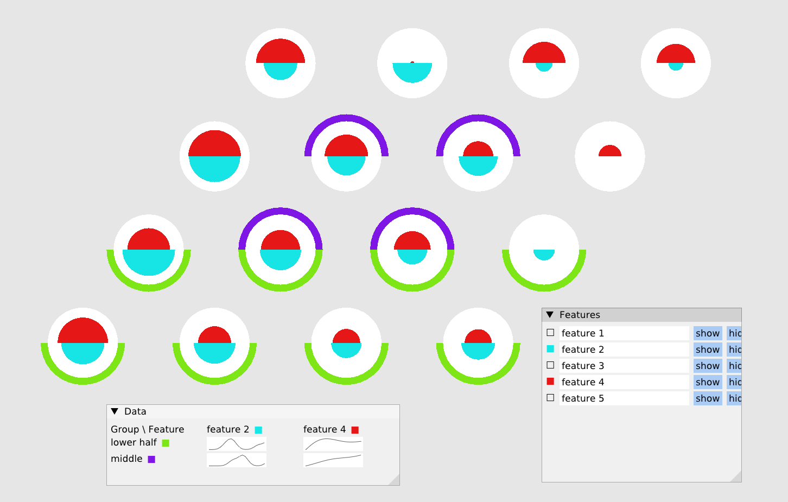

# ClusterPainter -- clustering annotation tool

`clusterpainter` is a simple graphical cluster-annotation tool. It is supposed
to work as a human front-end for working with the intermediate results as
produced by `remotesom`, or in general any other clustering methods.



#### Acknowledgements

`clusterpainter` was developed at [Bioinformatics
Core](https://www.uni.lu/lcsb-en/research-groups/bioinformatics-core/) of
Luxembourg Centre for Systems Biomedicine, of University of Luxembourg.

   

# How-to

### Installation

`clusterpainter` is implemented in Haskell, and is best installed with `cabal`
directly from the cloned repository.

Before installing `clusterpainter`, you may need several OS libraries installed
that allow `clusterpainter` to run the graphical interface; these include SDL2
and OpenGL libraries. Simply use your package manager to install the
development version of these libraries; on Debian-based systems this can be
done using `apt`:

```sh
apt install libsdl2-dev libgl-dev
```

Once the libraries are installed, `clusterpainter` may be built as usual with
`cabal`:

```sh
cd clusterpainter/
cabal install
```

To install `cabal` packaging tool and generally the Haskell platform and
compiler, use [GHCup](https://www.haskell.org/ghcup/).

### Starting `clusterpainter`

When built, you can start the `clusterpainter` as follows:

```sh
# this will print out a short summary of available options
cabal run clusterpainter
```

To test the tool on a demo dataset (stashed in directory
[`demo-data/`](demo-data/)), you can run:
```sh
cabal run clusterpainter -- \
  -f demo-data/features.json \
  -t demo-data/topology.json
```

### Using `clusterpainter` for annotation

If you want to use `clusterpainter` to annotate real datasets, you will have to
produce a "dataset summary", with prepared summary clusters that have a
topology (so that they can be displayed in 2D), and summarized cluster
features.

(Clusterpainter can also work with cluster weights and intra-cluster value
means and variances; see the documentation of options `-w`, `-m` and `-v`, and
possibly `-V` if you want to use assumed variances.)

The output of your annotation will be saved to a file specified by option `-o`:

```sh
cabal run clusterpainter -- \
  -f demo-data/features.json \
  -t demo-data/topology.json \
  -o output-annotation.json
```

The output annotation is formatted as a JSON object, which contains:

- array of defined group names (in key `group_names`)
- array of user-defined feature names (key `feature_names`)
- array of arrays with integer group indexes, that represents group membership
  assignment (in key `groups`) -- in the array, for each cluster, there's one
  inner array with 0-based indexes of all groups that the cluster belongs to
  (the indexes can be tought of as offsets into the `group_names` array)
  in a given cluster.

Example output is provided in
[`example-annotation.json`](demo-data/example-annotation.json).
